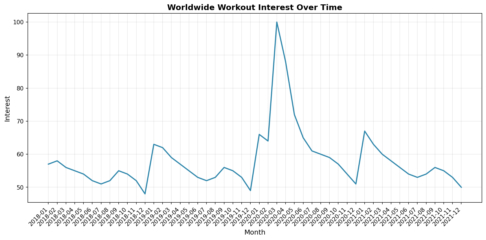
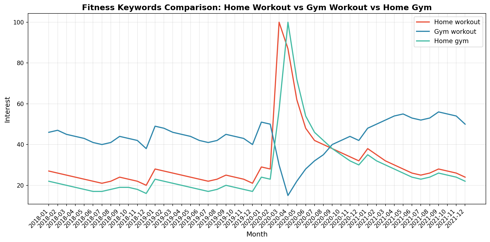
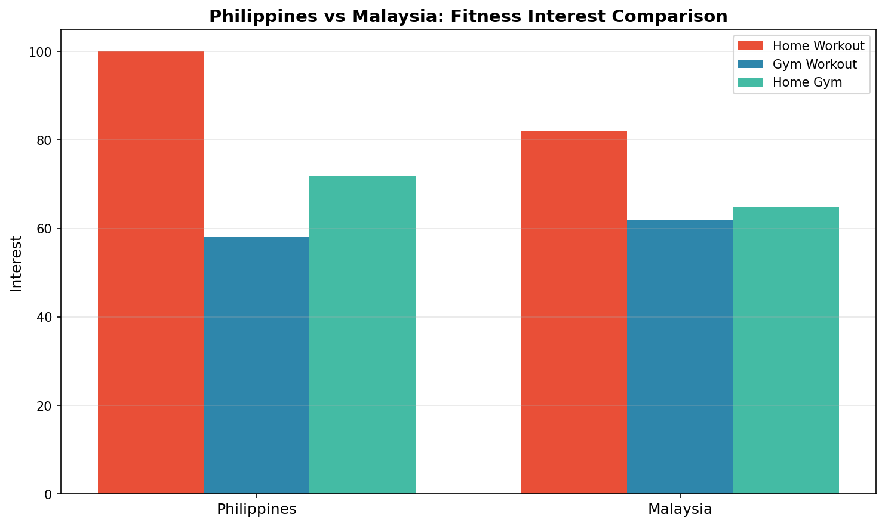

# Fitness Market Analysis with Python

Analysis of global fitness trends using Google Trends data. This project examines workout interest patterns across different countries and compares home workout vs gym workout trends during and after COVID-19.

## Dataset

Data sourced from [DataCamp Project](https://projects.datacamp.com/projects/1684)

## Analysis

### Worldwide Workout Interest Over Time

The chart shows the evolution of global interest in workouts, with a significant spike during March-April 2020 coinciding with worldwide COVID-19 lockdowns.

### Fitness Keywords Comparison

Comparing three fitness-related search terms:
- **Home workout** - Peaked during COVID lockdowns (March-April 2020)
- **Gym workout** - Dropped during lockdowns but recovered as gyms reopened
- **Home gym** - Saw sustained interest as people invested in home fitness equipment

### Geographic Comparison: Philippines vs Malaysia

Philippines shows higher interest in home workouts compared to Malaysia, while gym workout interest is more balanced between the two countries.

## Key Findings

| Metric | Result |
|--------|--------|
| Peak COVID trend | Home workout |
| Current trend | Gym workout |
| Top country for workout interest | United States |
| Higher home workout interest | Philippines (vs Malaysia) |

## Technologies Used

- Python
- Pandas
- Matplotlib
